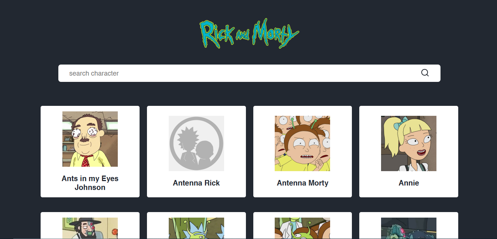
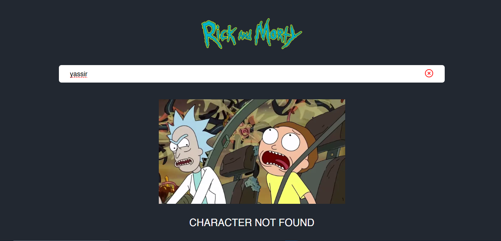
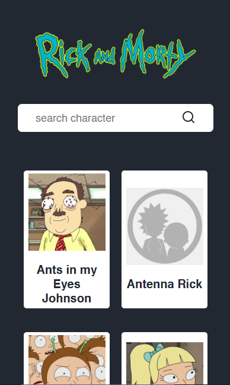

# Rick and Morty API Project

In this project, I fetch and display data from the Rick and Morty API. The goal is to explore how to work with external APIs and dynamically render data in a web application.

## Preview

#### Dekstop View


#### Search Not Found


#### Mobile View



## How To Run This Project

Clone this project url :

``` https://github.com/VsalCode/fgo-dom-fetching.git ```

after entering the folder, install the dependencies:

```npm install```

To run the web you can use the command :

```npm run dev```

##  dependencies used
- Live Server


## How To Contribute

Pull requests are welcome. For major changes, please open an issue first
to discuss what you would like to change.

Please make sure to update tests as appropriate.

## License

[ISC](https://opensource.org/license/isc-license-txt)
